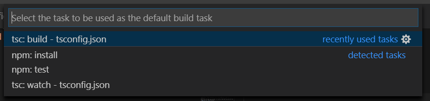
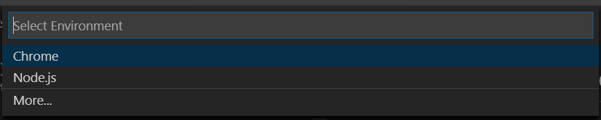
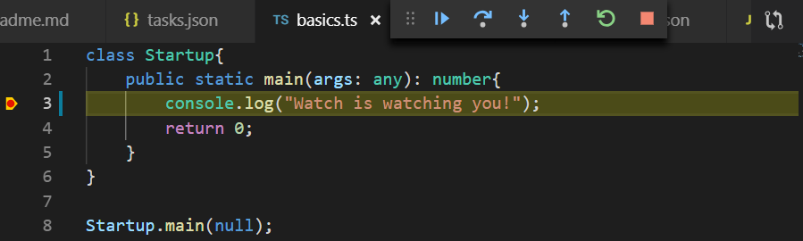

TypeScript (TS) Primer
====================
In this article we shall take a quick tour of the fundamental concepts in TS and how to apply them.
## Whats is TS?
TypeScript (TS) is a strict superset of JavaScript (JS) that adds on support for strong typing and advanced langauge features (such as interfaces, generics, decorators and many more). This massivley improves the expressibility of JS and promotes better structured code that is easier to maintain at scale.  The _'tsc'_ compiler transpiles TS down to pure JS (ES5 by default, but can also be made to target ES6) which may be executed either in the browser or in a Node.js runtime.  

## Setup Environment
The first step is to setup a development environment to play with. 
- **Installing TS**  
    The easiest way to install TS is to do it via _NPM_. This means we need to have _Node_ & _NPM_ installed.
    ```bash
    $ npm -g install typescript
    ```
    This should install TS in a global scope. On Windows, by default the installed path would be -
    ```bash
    $ where tsc

    $HOME/AppData/Roaming/npm/tsc
    $HOME/AppData/Roaming/npm/tsc.cmd
    ``` 
    We can check the installed TS version either by -
    ```bash
    $ tsc --version

    Version 2.8.1
    ```
    or listing the global _NPM_ packages -
    ```bash
    $ npm -g --depth=0 ls

    $HOME/AppData/Roaming/npm/
    +-- browserify@16.2.3
    +-- create-react-app@1.5.2
    `-- typescript@2.8.1
    ```
    This is the version I have installed at the time of writing this article.  

- **IDE - VS Code**  
    Because TS ultimately gets reduced to JS, it is possible to use any text editor and JS runtime. However for a productive development experince we shall be using VS Code, which comes with builtin support for TS such as deep intellisence, understanding type-declarationfiles, and integrated debugging. We can configure a TS project in VS Code with some minimal configuration. 

- **Manifest file - tsconig.json**  
    Typically the first step is to create a TS project configuration file called _tsconfig.json_. This file defines various options to be used, such as _compiler options_, _included/excluded files_ etc.  
    This file can be created manually and some basic standard options typed in (or copy-pasted from the web). Though now the better way to do this is using the _--init_ switch on the TS compiler.
    ```bash
    $ tsc --init
    ```
    This should create a _tsconfig.json_ file with a lot of options (most of which are commented out). We will just focus on the essentials for now - 
    ```javascript
    {
    "compilerOptions": {
        /* Basic Options */
        "target": "es5", /* Specify ECMAScript target version*/
        "module": "commonjs", /* Specify module code generation: 'none', 'commonjs', 'amd', 'system', 'umd', 'es2015', or 'ESNext'. */
        "sourceMap": true, /* Generates corresponding '.map' file. */
        // "lib": [], /* Specify library files to be included in the compilation. */
        // "declaration": true, /* Generates corresponding '.d.ts' file. */
        // "outFile": "./", /* Concatenate and emit output to single file. */
        // "outDir": "./",  /* Redirect output structure to the directory. */
    
        /* Strict Type-Checking Options */
        "strict": true, /* Enable all strict type-checking options. */
    
        /* Additional Checks */
        
        /* Module Resolution Options */
        "esModuleInterop": true, /* Enables emit interoperability between CommonJS and ES Modules via creation of namespace objects for all imports. Implies 'allowSyntheticDefaultImports'. */

        /* Source Map Options */

        /* Experimental Options */
        // "experimentalDecorators": true,        /* Enables experimental support for ES7 decorators. */
    }
    }
    ```  
    _Note that I have removed a lot of the commented lines for brevity._  
    With this VS Code can provide rich syntax highlighting and editing experince for the TS project.  

- **Trying it out**  
    At this stage we can actually try writing some simple TS code, compiling and running it. So we make a simple TS file _'basics.ts'_ with some _Hello World_ code - 
    ```typescript
    class Startup{
        public static main(args: any): number{
            console.log("Hello world!");
            return 0;
        }
    }
    Startup.main(null);
    ```
    A rudimentary class with a static method that prints to the console.
    To build and see the output we would do the following -
    ```bash
    $ tsc basics.ts
    $ node basics.js
    Hello World!
    ```
    The TS file gets compiled to JS and, then we can run it using Node.  

- **Build Task**  
    Now, even though we can manually build the _.ts_ file to JS from the commandline, this can become tedious as the codebase grows. Also as we shall see later we would want to run it directly from VS Code if we want to _debug_ the code.  
    We can configure VS Code to build the code using _Tasks_.  
    In almost any software development loop we would use tools for _linting_, _testing_, _building_, _packaging_, and _deploying_ (linters : ESLint, TSLint; build-tools : Ant, MSBuild, Make, Rake, Gulp, Grunt). As an IDE it is importnat to be able to execute these tools and analyze their results from within VS Code. This is what _tasks_ allow us to do.
  - To configure a _task_ within VS Code we can use the _"Command Palette"_ (F1 or Ctrl+Shift+p)
    - Start typing "Configure Default Build Task" and select that optoin. This will give us a dropdown with the options as shown - 
    
    In this case VS Code has detected that this is a TS project from the **tsconfig.json** file.  
  _Note that we can also configure other "Custom Tasks" if we need, for example to execute some shell scripts._

  - A shorter way is to directly invoke _"Run Build Task"_(Ctrl+Shift+b). It will again give us an option to select the _task to run_, and if it is the first time it will configure the build task.

  - **tsc: build** - Explicit build  
  If we select this option, it will create a **tasks.json** file, in a hidden folder **.vscode** within the project. This contains the configuration information for the behaviour of the _build task_.
  ```json
    {
      "version": "2.0.0",
      "tasks": [
          {
              "type": "typescript",
              "tsconfig": "tsconfig.json",
              "problemMatcher": [
                  "$tsc"
              ],
              "group": {
                  "kind": "build",
                  "isDefault": true
              }
          }
      ]
  }
  ```  
  The attributes in this file inform VS Code what the build behaviour should be.
  This is an explicit build option and we invoke it everytime we want to build using the "Run Build Task" (Ctrl+Shift+b) command.  
  This will build the TS files to JS without us having to invoke the compiler from the commandline.

  - **tsc: watch** - Build on change  
  If we want VS Code to automatically build everytime we modify and save a _".ts"_ file, wqe can configure the build to be in **watch** mode. We choose the **tsc: watch** option and this will create a **tasks.json** that looks like -
  ```json
  {
      "version": "2.0.0",
      "tasks": [
          {
              "type": "typescript",
              "tsconfig": "tsconfig.json",
              "option": "watch",
              "problemMatcher": [
                  "$tsc-watch"
              ],
              "group": {
                  "kind": "build",
                  "isDefault": true
              }
          }
      ]
  }
  ```  
  In this we can see that we are running the **"tsc"** compiler with the **"watch"** option. Now if we _run the build task_ (Ctrl+Sift+b), the task will start in **watch** mode and every time we save a change the TS files it will compile automatically.  
  _We can stop the running task when we are done or if we choose to._

- **Debug the code**  
    Running the JS file from the commandline is all fine, but when we need to debug it is better to do that from the IDE. To enable this, we do _"Start Debugging"_ (F5) and again VS Code will not know exactly what to do, so it prompts us to choose a runtime / debug-envirinment:
     
    _Note that VS Code comes with support for the Node.js runtime, but we can install debuggers for other runtimes such as Python, C++, C#, Chrome etc. if we need._  
    In this case we choose _Node.js_ and this will now create an additional file **launch.json** in the hidden _".vscode"_ folder. This file contains the configuration information to launch the applicaion in debug mode.
    ```json
    {
        "version": "0.2.0",
        "configurations": [
            {
                "type": "node",
                "request": "launch",
                "name": "Launch Program",
                "program": "${workspaceFolder}\\basics.js",
                "outFiles": [
                    "${workspaceFolder}/**/*.js"
                ]
            }
        ]
    }
    ```
    The _"type"_ indicates what the runtime environment is, _"request"_ indicates if it should _launch_ or _attach_ and the _"program"_ points to the entry-point file.  
    Now we can set a breakpoint and start debugging (F5), step over, step into, watch and modify variables etc. as we would do in any other IDE.
    
    
    This also changes the _"sourceMap"_ attribute value in the _"tsconfig.json"_ - 
    ```json
        "sourceMap": true,  
    ```
    This creates the _"*.js.map"_ files (on build), that enables the debugger to map execution point to a location in the source code.

    - **"launch" v/s "attach"**  
        VS Code gives two debugging modes, each for a different workflow - _"launch"_ and _"attach"_.   
         - When we want the debugger to _"attach"_ to a running process, like we would do to debug a _browser app_, we use the _"attach"_ mode. The attributes for this configuration would indicate the details of the process to attach to. For _Chrome debugging_ we typically use this.

         - When we need the process to be launched first, like when debugging server-side applications we specify the _"launch"_ mode. For _Node.js_ applications we would typically use _"launch"_.  

## Variable Declarations
TS follows the exact same keywords and behaviour for variable declaration as ES6+. 
- **var**  
    The _var_ keyword used to be the way we declare variable till ES5. It declares a variable that has _function scope_. This is different from many other languages and has the potential for some un-intended behaviour - 
    ```typescript
    var x = 10; // has "global" scope
    function foo(){
        var x = 20;
        if (true){
            var x = 15;
            // actually modifies the 'x' declared above
            console.log(`2 - x = ${x}`);
            // 2 - x = 15
        }
        console.log(`3 - x = ${x}`);
        // 3 - x = 15
        // the function level 'x' got modified to 15
        for (var x=0; x<3; x++){

        }
        console.log(`4 - x = ${x}`);
        // 4 - x = 3
        // the function level 'x' got modified!
    }
    console.log(`1 - x = ${x}`);
    // 1- x = 10
    foo();
    ```
    Output >>
    ```bash
        1 - x = 10
        2 - x = 15
        3 - x = 15
        4 - x = 3
    ```
    This gets especillay confusing when _variable hoisting_ gets into the mix.
- **let**  
    ES6+ and TS intrioduces _let_ keyword which has _block level scope_. This is more natural and avoids many potential pitfalls. Let us change the above example to _let_ - 
    ```typescript
    let x = 10; // has "module" scope
    function foo(){
        let x = 20;
        if (true){
            let x = 15;
            // this is new 'x' within the "if" block
            console.log(`2 - x = ${x}`);
            // 2 - x = 15
        }
        console.log(`3 - x = ${x}`);
        // 3 - x = 20
        // the function level 'x' remains same
        for (let x=0; x<3; x++){
            // this 'x' is a different loop variable in this block
        }
        console.log(`4 - x = ${x}`);
        // 4 - x = 20
        // the function level 'x' remians same
    }
    console.log(`1 - x = ${x}`);
    // 1- x = 10
    foo();
    ```
    Output >>
    ```bash
        1 - x = 10
        2 - x = 15
        3 - x = 20
        4 - x = 20
    ```
- **const**  
    Similarly the _const_ keyword introduced in ES6+ and TS is used to declare variables that should not be _re-assigned_.
    ```typescript
    function foo(){
        const x = 23;

        x = x + 3;
        // compiler error - x is read-only

        const o = [1, 2, 3];
        o.push(4);
        console.log(o);
        // Array(4) [1, 2, 3, 4]
        // the content of 'o' can be modified

        o = o.concat([10, 20]);
        // compiler error - 'o' cannot be reassigned
    }
    foo();
    ```
- If a variable will not change stick to _const_. Trying to use _const_ more forces us to write safer code, which can be easier to make asynchronous.
- If the value can change stick to _let_ as that contains the variable to the minimum scope. 
- We would rarely find a reason to use _var_ instead of _let_.
- These are known as the _principle of least privilege_.

## Basic Types

A primary goal of _TS_ is to bring _static typing_ to our _JS_ development. _TS_ achieves this by enabling us to specify the type of variables. The `tsc` compiler checks the code to ensure that the usage of the variables conform to and are consitent with the specified type.  
However, once compiled it is plain _JS_ and therefore no type information (from _TS_) is available at runtime!  
Even though it reduces to _JS_ at runtime, the static type capability of _TS_ during developemnt vastly improves our ability to scale it across larger teams, ensure better quality code with less chance of errors that leak to execution time.  

### Primitive Types
This is the same set of _primitive data types_ from _JS_, namely - `number`, `string`, `boolean`, `null`, `undefined`, `symbol` (introduced in _ES6_). In _TS_ we can declare variables specifying these types as shown -
- **boolean**  
    `boolean` is the simplest data type representing `true` or `false` values -
    ```typescript
    const hasValue: boolean = [].length > 0;
    console.log(hasValue);
    // false
    ```

- **number**  
    Like _JS_ all numeric values are _floating point_ values and have the type `number`. They can have _decimal_, _hexadecimal_, _binary_ & _octal_ formats -
    ```typescript
    const dec: number = 45;
    const hex = 0xff;
    const bin = 0b1101;
    const oct = 0o76;
    console.log(oct);
    // 62
    ```
    Ofcourse everything is _JS_ at runtime so we are still susceptible to _floating point rounding errors_ -
    ```typescript
    // floating point rounding error
    console.log(0.1 + 0.2 === 0.3);
    // false
    ```

- **string**  
    _JS_ and _TS_ uses the `string` type to represent textual data. In _TS_ the variables are specified to the of the type `string`. String data are instances of the `String` class.  
    We can declare string lterals enclosing them in double quotes (`""`) or single quotes (`''`) - 
    ```typescript
    const s = "Hello there!";
    console.log(typeof(s));
    // string
    console.log(s.constructor.name);
    // String
    ```
    _Templated strings_ allow us to span multiple line as well as interpolate variables into it. This uses the `dash` (\`\`) to enclose the text and (`${}`) to paramterize the variables -
    ```typescript
    let name: string;
    let last_login: number;

    name = 'Alan';
    last_login = 3;

    const msg: string = `Welcome ${name}!

    You last login was ${last_login} days back.`;
    console.log(msg);
    /*
    Welcome Alan!

    You last login was 3 days back.
    */
    ``` 
### Arrays
In _JS_ an array is a _mutable_, _ordered_ collection which is _untyped_. _TS_ allows us to specify the type of the values that an array can hold. There are two ways to declare arrays in _TS_ -
- Array syntax  
```typescript
const evens: number[] = [2, 4, 6, 8];
evens.push(10);

console.log(evens);
// (5) [2, 4, 6, 8, 10]

console.log(`type of 'evens' = ${evens.constructor.name}`);
// type of 'evens' = Array
```
- Type parameter (generic) syntax
```typescript
const odds: Array<number> = [1, 3, 5];
odds.push(7);

console.log(`(evens.constructor === odds.constructor) = ${evens.constructor === odds.constructor}`);
// (evens.constructor === odds.constructor) = true
```
Whilst they are largely equivalent, there can be subtle differences in their usage. If we have an array that can hold a more than one data type (a _union type_ say), then we can directly do that with the _generic_ syntax -
```typescript
let stream: Array<boolean | number> = [false, 5.4, 6.2, false, 7.8, true];
```
If we wanted to do that with the _array syntax_ we would need to declare a type that represents the _union type_ -
```typescript
type stream_val = boolean | number;
let stream: stream_val[] = [false, 5.4, 6.2, false, 7.8, true];
```
### Tuples
_Tuples_ are a common data structure in many programming languages to represnt a compound type of fixed length. In _JS_ we handle this using arrays, but _TS_ provides a syntax to reprsent _tuples_ - 
```typescript
let rec: [number, string];
rec = [1001, "Alan"];

// Error - Tuples are not Commutative!!
rec = ["Bob", 1002]; 
```
Behind the scene a _tuple_ is just a _JS_ array -
```typescript
console.log(`rec.constructor = ${rec.constructor.name}`);
// rec.constructor = Array
```
### Enums
_TS_ brings _enums_ over and above the standard _JS_ types. _Enums_ are found in most other programming lanugages and provide a set of friendly names over ordinal values. In order to use an _enum_ type we first have to define it -
```typescript
enum Days {sun, mon, tue, wed, thu, fri, sat};
let day: Days = Days.mon;

console.log(`The day is ${day}`);
// The day is 1

day = Days.tue;
console.log(`The day is ${day}`);
// The day is 2

console.log(day === Days.wed - 1);
// true
```
_Note - how a variable of _enum_ type holds a number value._  
By default the value starts and `0` and increments by `1`, we can however change or specify these values as we desire -
```typescript
enum Magnitude {Ones = 1, Tens = 10, Hundreds = 100, Thousands = 1000};
let mag: Magnitude = Magnitude.Hundreds;

console.log(`Magnitude is ${mag}`);
// Magnitude is 100
```
A nifty thing about _enums_ in _TS_ is that we can easily go from the numberic value to its name as a string quite easily by accessing it using an index syntax -
```typescript
console.log(`Magnitude is in the ${Magnitude[mag]}`);
// Magnitude is in the Hundreds
```

### Any
If we wish to indicate that the value is not any specific type and can be _any_ type we use the `any` data type. This may be the case when working with dynamic content, or existing _JS_ libraries etc. Also note that `any` is different from specifying a value as `Object`, as for the latter _TS_ will typecheck to ensure we can only use members of `Object` on the value - 
```typescript
let data: any;
data = 23.43;
data = "Some text!";
console.log(data.length);
// data.length is accepted since type is 'any'

let val: Object;
val = "Some other text!";
console.log(val.length);
// comipler will complain as 'Object' does not have 'length' property
```

### Void
`void` is used to indicate that the context has _no type_ at all. Typically used with functions that do not return a value - 
```typescript
function greet(name: string): void{
    console.log(`Hellow ${name}`);
}
```
It is obviously meaningless to declare variables of thios type, as the only values it could have would be `null` and `undefined`.

### Null and Undefined
`null` and `undefined` are really singleton values that variables can have to indicate the absence of a _value_. In _TS_ these two special values have their own types which are called the same. A variable to which nothing has been assigned starts off with `undefined`.
```typescript
let a;
console.log(typeof(a)); // undefined

let b = null;
console.log(typeof(b)); // object
b = 23;
console.log(typeof(b)); // number

let c: null = null;
console.log(typeof(c)); // object
c = 34; // 34 is not assignable to type 'null'
```

### Never
_TS_ uses `never` type to represent functions that _never_ returns, such as those that will always throw an exception or goes into an infinite loop. We cannot assign any value to a varaible of type `never` (except `never` itself). It's purpose is for the type-sysetm to represnet functions that have no return.
```typescript
function fail(): never {
    throw new Error();
}
```

### Object
Any value with _non-primitive_ type will have `object` as its root type.
```typescript
const evens: number[] = [2, 4, 6, 8];

console.log(`type of evens = ${typeof(evens)}`); 
// type of evens = object
// using 'typeof' gives 'object'

console.log(`actual type of evens' = ${evens.constructor.name}`);
// actual type of evens = Array
// use 'constructor' to find detailed type at runtime!
```

## Type Assertions
_Type assertions_ are a way of forcibly specifying the value of a type as something that may be other than what the _transpiler_ infers. It is like _type casting_ in other languages, the difference is that _type assertion_ is only a comiple time feature that instructs the _transpiler_ to treat the value as a specific type. It has no checking or restructuring of data (unlike _boxing_/_unboxing_ in _C#_ for example) -
```typescript
let a: any = 'Hello there';
console.log((<string>a).toUpperCase()); // HELLO THERE
// using '<type>' to assert the type of the variable

let b = 'Hello again';
console.log((b as string).toLowerCase()); // hello again
// using 'as' to assert type  
```
_Type assertion_ syntax can have two forms - prefixing with `<the-type>` or qualify with `as`. Either form is acceptable, though in _JSX_ only `as` assertions are allowed. Since the two forms have no runtime differences (unlike languages such as C# where these two forms have different semantics), it is better to stick to one consitent standard for a project/team.

## Destructuring

Destructuring is a syntactic construct that allows the `expansion` of a _collection or composite_ on the right into _individual varaibles_ on the left in an assignment.

### Array Destructuring

We can use destructing on _Arrays_ as shown:
```typescript
const nums = [100, 200, 300];
const [first, second] = nums ; // array destructuring
console.log(`first = ${first} and second = ${second}`);
```  
Note how the extra values to the right get ignored in the destructuring assignment.  
This is useful for writing functions that take arrays as paramter and we want to access the elements within.  
```typescript
function foo([p1, p2]: Array<number>){
    console.log(`first arg = ${p1} and second arg = ${p2}`);
}
const nums = [10, 20 , 30, 40];
foo(nums);
```  
- **Partial destructuring (...\<remaining>)** -  
If we wish to destructue only part of the array, say the first couple of elements and obtain what is left as another array, we can do that using the `"..."` operator - 
```typescript
const nums = [10, 20 , 30, 40, 50];
const [first, second, ...rest] = nums;
console.log(`first = ${first}, second = ${second}`);
// first = 10, second = 20
console.log(`rest= ${rest}, type of 'rest' = ${rest.constructor.name}`);
// rest= 30,40,50, type of 'rest' = Array
```
Note how the `rest` variable is an `Array` containing the remaining elements.

- **Ignoring elements** -  
Since it is all `JavaScript` we can simply ignore elements we are not interested in -
```typescript
const nums = [10, 20 , 30, 40, 50];
const [, second, , fourth] = nums;
console.log(`second = ${second}, fourth = ${fourth}`);
// second = 20, fourth = 40
```

### Tuple Destructuring

Just like _arrays_ we can destructure _tuples_ -
```typescript
let rec: [number, string, boolean];
rec = [1001, 'Alan', true];

// destructure tuple to individual variables
let [roll_num, name] = rec;
console.log(`${roll_num} - ${name}`); // 1001 - Alan
```  

For _tuples_ too we can access part of the elements individually and the remaining as a subset tuple, using the `...` operator -
```typescript
// destructure partially
let [roll_num, ...rest] = rec;
console.log(`${roll_num} - ${rest}: ${rest.constructor.name}`);
// 1001 - Alan,true: Array
```

We can ignore the fields we do not need -
```typescript
// destructure ignoring some feilds
let [, name, ] = rec;
console.log(`name is '${name}'`);
// name is 'Alan'
```

### Object Destructuring

We can destructure _objects_ in the similar fashion as we do _arrays_ and _tuples_, however the variables on the left should have the same name as the object properties - 
```typescript
let my_obj = {
    id: 1001,
    name: 'Alan',
    active: true,
    score: 78
};

// the following will fail !!!!
let {i, n} = my_obj;
// error : 'i' does not exist on ...

// this will work
let {id, name} = my_obj;
console.log(`id=${id}, name=${name}`);
// id=1001, name=Alan
```

- **Using '`...`' for remaining properties**  
Just like _arrays_ and _tuples_ we can use `...` to partially destructure an object and get the remaining properties as a new object -
```typescript
let {id, name, ...score} = my_obj;
console.log(`Id = ${id}, score = ${score.score}`);
// Id = 1001, score = 78
```

- **Rename Properties while destructuring**  
It is possible to destructure objects to variables with names different from the declared property names, albeit with some 'confusing' syntax -
```typescript
// destructure object with different variable names
let {id: id_num, name: first_name} = my_obj;
// read - 'id' as 'id_num', 'name' as 'first_name'
console.log(`ID = ${id_num}, First Name=${first_name}`);
// ID = 1001, First Name=Alan
```
This syntax is a bit strange and better to be avoided.

- **Default Values while destructuring**  
We can specify _default values_ when destructuring objects -
```typescript
// defualt values when destructuring
let {id, name, active = false, score = 0} = {id: 1002, name: 'Bob'};
// active = false, score = 0
```

## Spread (`...`)

_Spread_ is very similar to _destructuring_ - _spread_ **expands** a collection (_array_, _object_) into another _array_ or _object_ (whereas _destructuring_ expands a collection into _individual_ varaibales).
- **Array spread** -
```typescript
let a = [10, 20, 30, 40];
let b = [1, 2, 3, 4, ...a, 100, 200, 300];
console.log(b);
// [1, 2, 3, 4, 10, 20, 30, 40, 100, 200, 300]
```
The array `a` gets spread into the array `b`.

- **Object spread** -  
We can _spread_ an object into another object in a simialr fashion.
```typescript
const def = {room: "single", smoking: false, nights: 1};
let booking = {...def, nights: 3};
console.log(booking);
// {room: "single", smoking: false, nights: 3}
```
The `def` object gets spread into the `booking` object, and the `nights` property gets overwritten. However, there order of specfying the properties matter when we _spread_ and _object_ -
```typescript
booking = {nights: 3, ...def};
console.log(booking);
// {nights: 1, room: "single", smoking: false}
```
The _spread_ comes later so it overwrites the `nights` poroperty to its value of `1` and the more specific valeu gets lost!  
Another importnat point to remember is that when we _spread_ an object only its **enumerable** properties get copied (i.e. it is a shallow copy of the object). This can lad to confusing behaviour such as -
```typescript
const def =  
{
    room: "single",
    smoking: false,
    nights: 1,
    isAvailable: function(): boolean{
        return false;
    }
};
let booking = {...def, nights: 3};
console.log(booking);
// {room: "single", smoking: false, nights: 3, isAvailable: ƒ}
```
In this case the method `isAvailable` gets copied because it is on the object itself, but the below will not work - 
```typescript
class Res 
{
    room = "single"; 
    smoking = false;
    nights = 1;
    isAvailable(): boolean{
        return false;
    }
};
const def = new Res();
let booking = {...def, nights: 3};
console.log(booking);
// {room: "single", smoking: false, nights: 3}
booking.isAvailable(); // Error - isAvailable() does not exist..
```
This is because when declaring `class Res` the methods get defined on the _prototype_ `Res.prototype`
```typescript
console.log(Res.prototype);
// {constructor: ƒ, isAvailable: ƒ}
```

## Structural Typing and objects

#### Structrural Typing
When in comes to type-checking objects _TS_ takes an approach called _structural typing_ where the type is determined by the _'properties the object has'_, rather than the name of the type (a.k.a _nominal typing_). Languages such as _C#_ and _Java_ have nominal typing, so it is useful to look at a few examples to understand how _TS_ type checks objects -
```typescript
// define a variable 'z' with type as an object with 3 properties
let z: {p1: string, p2: boolean, p3: number};

// 'a' is an object literal with same 3 properties
const a = {p1: "a", p2: false, p3: 34};
z = a;
// 'a' can be assigned to 'z'

// 'b' has one more property 'p4'
const b = {p1: "b", p2: true, p3: 23.3, p4: []};
z = b;
// 'b' assigned to 'z', extra property ignored
// this has an excption though!

const c = {a1: "c", a2: true, p3: 23.3};
z = c;
// Error - 'c' does not have 'p1' and 'p2'
// property names have to be same

const d = {p1: "d", p2: true};
z = d;
// Error - 'z' expects a property 'p3'
```  
As long as the value has all the propeties that the type expects the type check will pass.  

#### Excess Property Check
When it comes to _extra properties_ it seems they are ignored. However there is a slight nuance to this called _excess property check_ - basically _TS_ does NOT allow _object literals_ with excess properties to be assigned to a type that does not have them, however it will allow an _object variable_ with excess properties to be assigned (this is what we see above with 'b'). We can see it more clearly in the exmple below -
```typescript
let z: {p1: string, p2: boolean, p3: number};

z = {p1: 'b', p2: false, p3: 23, p4: []};
// Error - object literal with extra property 'p4'

const b = {p1: 'b', p2: false, p3: 23, p4: []};
z = b;
// OK - since variable 'b' is assignd to 'z'
```
If we have an _object literal_ with excess properties that we have to assign to a type that does not have them, or pass it as an argument to a function that has a parameter type that does not have those properties we can use _type assertion_ -
```typescript
let z: {p1: string, p2: boolean, p3: number};

z = ({p1: 'b', p2: false, p3: 23, p4: []} as {p1: string, p2: boolean, p3: number});
// Ok - object literal has been morphed to the target type
```
Of course at this point we have to step back and re-look at what we are trying to do. This example here is simply to demostrate the concept. When the _type_ of an object needs to be specified it would typically be a **class** or an **interface**.

#### Optional Properties
We can make properties optional by suffixing them with `?`-
```typescript
// object with 'p1', 'p2' and optional 'p3'
let z: {p1: string, p2: boolean, p3?: number};

const d = {p1: "d", p2: true};
z = d;
// 'p3' is optional so this is allowed
```

#### Readonly Properties
_Optional_ (`?`) is not the only _modifier_ we can apply to a property, we can make it **readonly** if we wish to ensure that it shouldn't be modified after an initail value is assigned.
```typescript
// specify a type with a property as readonly
let foo: {p1: string; readonly p2: number};

// we can assign instances to this variable now
foo = {p1: 'a', p2: 23};

// we can change the instance assigned to the variable
// since we used 'let' and not 'const'
foo = {p1: 'b', p2: 34};

// we can modify the values of the normal property
foo.p1 = 'c';

// Error - cannot modify the value of readonly property
foo.p2 = 56;
```
If we had used `const` then we would have had to initailize it along with the definition -
```typescript
// define and initalize
const foo: {p1: string; readonly p2: number} =
    {p1: 'a', p2:23};

// Error - we cannot assign to constant
foo = {p1: 'a', p2: 23};

// we can modify the values of the normal property
foo.p1 = 'c';

// Error - cannot modify the value of readonly property
foo.p2 = 56;
```

#### Index Signature
Another important concept of objects to be familiar with **index signature**. In _JS_ we can access an object's property using either the `.` notation or using `[key]` notation (_JS_ objects are hashmaps under the hood). 
```javascript
let foo = {p1: "Hello", p2: 23};
// '.' access
console.log(foo.p1); // Hello
// index access
console.log(foo['p2']); // 23
```
We can also specify properties on the fly - 
```javascript
let foo = {};
foo.p1 = 'Hello';
// index notation
foo['p2'] = 23;
```
The _index key_ is expected to be `string` or `number` (it has to be something _JS_ can hash). _JS_ does not enforce the type of the index strictly, what it does however is implictly call `toString()` method on the _key_ to get a string value (if _key_ is a _number_ the runtime optimizes and uses the number). We can make this implicit call behaviour visible like so -
```javascript
let foo = {};

const my_key = {
    toString() {
        console.log('called toString()!');
        return 'my_key';
    }
};

foo[my_key] = "Value 1";
// prints - called toString()!
```
_TS_ on the other hand restricts the type of the _index key_ to be a `string`, `number` or `Symbol` -
```typescript
let foo: any = {};

foo['p1'] = 'v1';
// this is ok

foo[0] = 'v2';
// this is ok

foo[false] = 'v3';
// Error - 'false' cannot be used as an index type

const my_key = {};
foo[my_key] = 'v4';
// Error - Type '{}' cannot be used as an index type
```
With **index signature** _TS_ gives us a mechanism to define a dynamic set of properties for an object. We do this using the syntax `[index: string]: type` - 
```typescript
// define the object type
let foo: {
    // using 'index signature'
    [index: string]: string;
}

// initailize foo
foo = {};

// assign property values
foo['a'] = "Alpha";
foo['b'] = 'Beta';
console.log(foo); // {a: "Alpha", b: "Beta"}
console.log(foo.a); // Alpha
```
Note that in the syntax `index` is not a _keyword_, we can use any indentifier there -
```typescript
// define the object type
let foo: {
    // using 'index signature'
    [some_random_text: string]: string;
}
```
Whilst the _value_ can be any type, the _index type_ has to be one of `string`, `number` or `Symbol` (it has to be hashable).
```typescript
// define the object type
let foo: {
    // using 'index signature'
    [index: number]: {month: string};
}

// initailize foo
foo = {};

// assign property values
foo[1] = {month: "Jan"};
console.log(foo[1]); // {month: "Jan"}

foo[2] = {day: "Wed"};
// Error - the type of the value does not match {month: string}
```
One _constraint_ with **index signature** is that as soon as you have a string index signature, all explicit members must also conform to that index signature. The reason is that if we try to access the _explicit property_ using the _index string_ it coudl result in a different type. This would be an inconsistent type behaviour - 
```typescript
let foo: {
    [index: string]: number;
    p1: number; // this is OK

    p2: string  // Error - type string not assignable to number
}

foo = {p1: 0};
foo['a'] = 1;

console.log(foo['a']); // 1
console.log(foo['p1']); // 0

// if we allowed 'p2: string' then
console.log(foo['p2'])
// -> would have to give back 'string' type!
```
**Index signature** is useful for data structures such as an '_options bag'_, and we wnat to define a type (an _interface_ or _class_) for that. We wont know all the properties upfront but we know the type (if we don't we can use `any`).

## Interfaces
Till now we have defined an used complex types by their shape (members). In practice though we tend to give these types a name and we can do that using - **type aliases**, **classes** or **interfaces**. _TS_ **interfaces** are simialr to other programming languages such as _C#_ and _Java_, but supports some _additional concepts_. Let us take a look at  and how we can use them - 
```typescript
// define an interface 
interface TaxCalculator{
    readonly desc: string;
    rate: number;
    getTax(amt: number): number;
}

// decalre an object of that interface
const salesTax: TaxCalculator = {
    desc: "Sales Tax",
    rate: 0.05,
    getTax(amt: number): number{
        return amt * this.rate;
    }
}

console.log(salesTax.getTax(100));
```
Note how in _TS_ interfaces can have _properties_ as well as _methods_.  
Also unlike other languages the object we assign to the something of this interface type does not have to implement the interface, it just needs to support the shape described by the interface (_strucural typing_) -
```typescript
// define an interface 
interface TaxCalculator{
    readonly desc: string;
    rate: number;
    getTax(amt: number): number;
}

// a function that uses this interface
function getTotal(amt: number, calc: TaxCalculator): number {
    return amt + calc.getTax(amt);
}

// salesTax has the shape of the interface
// but it does not implement it
const salesTax = {
    desc: "Sales Tax",
    rate: 0.05,
    getTax(saleAmt: number): number{
        return saleAmt * this.rate;
    }
}

console.log(getTotal(100, salesTax)); // 105
```
Since an interface is effectively defining a name to the shape of an object, it supports all the simialr concepts we covered above with plain objects, such as  
- **Excess property check (for literals)**
- **Optional properties**
- **Readonly properties**
- **Index signature** -
```typescript
// define an interface 
interface Rectangle{
    length: number;
    breadth: number
}

function getArea(rect: Rectangle){
    return rect.length * rect.breadth;
}

// OK - objcet literal matches interface
console.log(getArea({length: 2, breadth: 3})); // 6

// Error - extra property 'height' does not match interface
console.log(getArea({length: 2, breadth: 3, height: 4}));

let r1 = {length: 2, breadth: 3, height: 4};
// OK - assigning a variable bypasses excess prop check
console.log(getArea(r1)); // 6
```
Using an interface for an _'options bag'_ -
```typescript
interface ConfigItems {
    name: string;
    // index signature
    [key: string]: string;
}

const envConfig: ConfigItems = {
    name: "Env Config",
    kernel: "Linux",
    distro: "Debian",
    version: "18.0.2"
}

function showEnv(config: ConfigItems) {
    console.log(config);
}

// pass in our 'envConfig' object
showEnv(envConfig);
```
#### Function Types
In _TS_ _interfaces_ can describe a wide range of 'shapes', not just _objects_. We can use _interfaces_ to define _function types_. We specify the function signature as an interface and then use them to decalre varaibles or parameters of tha type. This is useful with _functional programming style_ -
```typescript
// define a function-type interface
interface CalcTax{
    // function signature
    (amt: number, rate: number): number;
}

// a HOF that takes a 'calc' function as argument
function calcTotal(amt: number, calc: CalcTax){
    return amt + calc(amt, 0.05);
}

// 'lambda expression' as argumemnt for function-type
console.log(calcTotal(100, (a, r) => a * r)); // 105
```
Note how the actual parameter names of the _function type_ does not matter, just the _function signature_.

#### Indexable Types
Just like we used an _interface_ to define a _function type_ (that we can invoke directly), we can define a type that we can directly _'index into'_.
```typescript
// define an indexable-type with number index
interface SaleItems{
    [index: number]: {sku: string, price: number};
}

// 'sales' is an indexable type
let sales: SaleItems;

// declare sales like an array
sales = [
    {sku: "lamp", price: 34.5 },
    {sku: "cable", price: 10.0 },
    {sku: "shade", price: 8.5 },
    {sku: "switch", price: 15.0 }
];

console.log(sales[0]); // {sku: "lamp", price: 34.5}
```
Whilst this gives an _indexable type_ that looks like an array we cannot use `for .. of` (_iterator pattern_) with this, since it does not automatically implement an iterator. So if we try to do the following _TS_ will complain -
```typescript
// Error - Type 'SalesItem' does not have an iterator
for (let s of sales) {
    // ...
}
```
The _'index type'_ can be either `string` or `number`. It is possible for an indexable type to combine these two together as well.  
> However, the type of the _'number index'_ property should be a subtype of the _'string index'_ property.  

This is because even when indexing with a _'number'_ _JS_ implicitly converts that into a _'string'_ and use that for the indexing. Therefore if a type has both _'number'_ and _'string'_ index types, when accessing the property it is effectively as if we are accessing with _'string'_, which imples that the type of the value returned should be the type/subtype of the _'string'_ indexed property -
```typescript
// define a class
class Diode {
    volts: number;
    ampere: number;
}

// define a subclass
class LED extends Diode {
    lumen: number;
}

// indexable type of 'Diode/s'
interface Board{
    [index: number]: LED;
    [key: string]: Diode;
}
// This is OK - Board[number] is subtype of Board[string]
```
However the below will fail -
```typescript
interface Board{
    [index: number]: Diode;
    [key: string]: LED;
}
// Error - Board[number] is not assignable to Board[string]
```
> Another subtle point is that if we specify _index signature_ with _'string index type'_, then the _'norma'_ ('non-indexed') properties should also have types that are same or assignable to the type of the _string indexed_ property. This is because in _JS_, properties which we can access as `obj.property` should also be accessible as `obj[property]` - 
```typescript
interface Board{
    [key: string]: Diode;
    indicator: LED; // Ok - LED <= Diode
    Id: number; // Error - 'number' NOT assignable to 'Diode'
}
```
Accessing `myBoard.Id` should be same as `myBoard['Id']`, and then the latter becomes a _string indexing_ access for which the type specified is `Diode`. Therefore the type of `myBoard.Id` should be a subtype of `Diode`.

#### Class Types
Till now we have used _interfaces_ as a type definnition for the _shape_ of something (an objcet, or functio, or indexable collection), we have not used it as a contract for _implementing_ a _class_. In established languages which were originally very Object-Oriented (such as _C#_, _C++_ and _Java_), the main use of _interfaces_ was to specify a public contract that for _calsses_. In _TS_ we can do the same - 
```typescript
// an interface for tax calculators
interface TaxCal{
    readonly desc: string;
    rate: number;
    calc(amt: number): number;
}

// class service tax
class ServiceTax implements TaxCal{
    desc: string = "Service Tax";
    rate: number = 0.15;
    calc(amt: number): number{
        return amt * this.rate;
    }
}


// class sales tax
class SalesTax implements TaxCal{
    desc: string = "Sales Tax";
    rate: number = 0.05;
    calc(amt: number): number{
        return amt * this.rate;
    }
}

// variable with 'TaxCalc' interface
let taxCalc: TaxCal;

// Sales tax instance
taxCalc = new SalesTax();
console.log(taxCalc.calc(100)); // 5

taxCalc = new ServiceTax();
console.log(taxCalc.calc(100)); // 15
```
One thing to note is that _interfaces_ in _TS_ can be used to specify only the _public_, _instance level_ contract of a class. We cannot use it to specify the _static_(_class level_) contracts such as _constructors_.  
So in the above example if we make it a _'generic tax calculation'_ class that takes the _rate_ and _name_ as _constructor parameters_ we can modify it as - 
```typescript
// an interface for tax calculators
interface TaxCal{
    readonly desc: string;
    calc(amt: number): number;
}

// calss for general tax calculation
class GeneralTax implements TaxCal{
    desc: string;
    private readonly rate: number;

    // constructor to take 'desc' and 'rate' as arguments
    constructor(desc: string, rate: number){
        this.desc = desc;
        this.rate = rate;
    }

    calc(amt: number): number{
        return amt * this.rate;
    }
}
```
In this case we specify a _'constructor'_ that can take the values to set for the properties.  
##### Construct Signatures
This works fine, however as we can see the _interface_ does NOT enforce the _'constructor'_ itself and leaves it open. If we want the _interface_ to specify that the class should have a _'constructor'_, we could try adding a **construct signature** in the interface -
```typescript
interface TaxCal{
    readonly desc: string;

    // construct signature
    new(desc: string, rate: number): TaxCal;

    calc(amt: number): number;
}

// calss for general tax calculation
class GeneralTax implements TaxCal{ // Error !!!
    desc: string;
    private readonly rate: number;

    constructor(desc: string, rate: number){
        this.desc = desc;
        this.rate = rate;
    }

    calc(amt: number): number{
        return amt * this.rate;
    }
}
```
However now _TS_ will complain that the class `GeneralTax` does not implement the _Construct signature_!!.  
This is because **construct signatures** are a **static(_class level_) operation** and since _interfaces_ are for specifying _instance level_ members, classes canot implement them.

##### Constructor Functions & Class expressions
The patterns used in _TS_ for this are **'constructor function'** and **'class expression'**.  

In the above example we can move the _construct signature_ to a separate interface declaration, and then have a **constructor function** which uses that to create the class instances -
```typescript
// interface with construct signature
interface TaxConstructor{
    new(desc: string, rate: number): TaxCal;
}

// an interface for tax calculators
interface TaxCal{
    readonly desc: string;
    calc(amt: number): number;
}

// calss for general tax calculation
class GeneralTax implements TaxCal{
    desc: string;
    private readonly rate: number;

    // has a constructor that has the shape of 'TaxConstructor'
    constructor(desc: string, rate: number){
        this.desc = desc;
        this.rate = rate;
    }

    calc(amt: number): number{
        return amt * this.rate;
    }
}

// constructor function - (factory)
function createTax(ctor: TaxConstructor, desc: string, rate: number) {
    return new ctor(desc, rate);
}

// use factory function to create instances
const tax = createTax(GeneralTax, "Sales Tax", 0.05);

console.log(tax.calc(100)); // 5
```
A few things to note about the above code -
- The `createTax` factory function has a parameter that takes a _construct signature_ interface (`TaxConstructor`). 
- The class `GeneralTax` itself has a _`constructor`_ which has the _"shape"_ of the `TaxConstructor` _construct signature_, though it does not (cannot) implement that interface itself. Because of this the `createTax` method can accept the **class** (`GeneralTax`) as an argument.  

Instead of using a _factory function_ explicitly we can make the code a bit more terse by leveraging **class expression** -
```typescript
// interface with construct signature
interface TaxConstructor{
    new(desc: string, rate: number): TaxCal;
}

// an interface for tax calculators
interface TaxCal{
    readonly desc: string;
    calc(amt: number): number;
}

// 'class expression'
// identifier 'GenTax' of type interface with 'construct signature'
const GenTax: TaxConstructor = class GeneralTax implements TaxCal{
    desc: string;
    private readonly rate: number;

    constructor(desc: string, rate: number){
        this.desc = desc;
        this.rate = rate;
    }

    calc(amt: number): number{
        return amt * this.rate;
    }
}

// use the class expression identifier like a constructor
const tax: TaxCal = new GenTax("Sales Tax", 0.05);

console.log(tax.calc(100)); // 5
```
Here we simply reframed the _class declaration_ as a _class expression_ with an identifier `GenTax` that we can treat like we would a class. `genTax` has the shape of `TaxConstructor`, and we can use it like we would a _class name_.

#### Extending Interfaces
Like _classes_, _interfaces_ can extend other _interfaces_. The resultant _interface_ would _inherit_ the _member definitions_ of the parent. 
```typescript
// base type for UI controls
interface UIControl{
    id: string;
    visible: boolean;
}

// type for textbox control
interface UITextBox extends UIControl{
    text: string;
}
```
Using this _inerface hierarchy_ to type variables can be slightly different from traditional _class based_ object-oriented languages. In _TS_ we can use these _interfaces_ as object types and if we try to assign an object with the _shape_ of the _child interface_ to a variable of the _parent interface type_ it will give an error (since that is an _excess property_) - 
```typescript
// variable of type parent interface
let txtCtrl: UIControl;

// assigning an 'object' of child interface -
// to a parent interface variable will NOT work
txtCtrl = {
    id: "txtBox1",
    visible: true,
    text: "lorum ipsum";   // Error - this property does not exist on UIControl
}
```
However with _classes_ it will follow the familiar object-oriented behaviour -
```typescript
class TextBox implements UITextBox{
    readonly id: string;
    visible: boolean;
    text: string;

    constructor(id: string, text: string) {
        this.id = id;
        this.visible = true;
        this.text = text;
    }
}

// instance of a class that implements the child interface WILL work
txtCtrl = new TextBox("txtBox2", "lorum ipsum");
```
An instance of a _class_ that implements the _child interface_ can be asigned to a varaible of the _parent interface type_.
```typescript
// however we cannot access the child interface properties
console.log(txtCtrl.text); //Error - property 'text' does not exist on UIControl
```
Of course we cannot access the property(member) of the _child interface_ using the _parebt interface type_ variable. To do that we would have to _'type assert'_ it into the desired type -
```typescript
// we can use 'type assertion' to access the 'text' property
console.log((txtCtrl as UITextBox).text);
```

#### Hybrid Types
As we have seen in _TS_ _interfaces_ have the ability to describe a variety of types and shapes. It quite naturally flows to have _hybrid types_ that are a combination of what we have seen above - 
```typescript
// hybrid type interface - defiines
// a function and object composite
interface Counter{
    (): number; // funtion => returns a count value
    interval: number; // property for interval
    reset(): void; // method to reset
}

// a factory function to create our object
function getCounter(start: number = 1, interval: number = 1): Counter{
    const fn: Counter = function () { 
        let val = start;    // Closure over outer variable/param 'start'
        start++;
        return val;
    };
    let initVal = start;
    fn.interval = interval;
    fn.reset = function () {
        start = initVal;  // Closure over outer varaible 'initVal'
    }
    return fn;  // return closure
}

const c1 = getCounter(10);
// invoking 'c1' as a plain function
console.log(c1());  // 10
console.log(c1());  // 11
console.log(c1());  // 12
// calling  a 'method' on 'c1'
c1.reset();         // resets to 'initVal'
console.log(c1());  // 10
```
In the example above we have an interface with:
- a call signature `(): number`
- a property `interval: number`
- a method `reset(): void`
With a value of this type we should be able to use it like a _function_ as well as an _object_ as shown with the call to `c1()` and `c1.reset()` respectively.
> An interesting thing to note about the factory-function `getCounter` is how we make use of **closure** over function variables to handle state. This is a common pattern in _JS_ and in functional programming styles. 

#### Interfaces Extending Classes
In _TS_ _interfaces_ can not only extend(inherit) from other _interfaces_ but also from _classes_. An _interface_ that extends a _class_ will inherit all the members of the _class_ without the implementation. It will also inherit all _private_ and _protected_ members! - 
```typescript
class UIControl{
    private id: string;
    visbile: boolean;

    constructor(id: string, visible = true) {
        this.id = id;
        this.visbile = visible;
    }
}

// interface extending the class 'UIControl'
interface SelectableControl extends UIControl {
    select(): boolean;
}
```
Now `SelectableControl` will have all the members of `UIControl` plus the method `select(): boolean`. Since it inherits _private_ members as well, there is an interesting result that _only subcalsses of the parent class (from which the interafce extends) can implement the interface_. So if we try the below, it will not work -
```typescript
// a class trying to implement 'SelectableControl'
class TextLabel implements SelectableControl{
    private id: string; // this will conflict with inherited property 'id'
    visbile: boolean;

    constructor(id: string, visible = true) {
        this.id = id;
        this.visbile = visible;
    }

    select() : boolean {
        return true;
    }
}
// ERROR - class 'Textlabel' incorrectly impelemnts interface `SelectableControl`
// types have separate declarations of private property 'id'
```
To make this work we can make the `TextLabel` extend from `UIControl` AND `implement` our _interface_ -
```typescript
// a class base-class and implement 'SelectableControl'
class TextLabel extends UIControl implements SelectableControl{
    select() : boolean {
        return true;
    }
}
```
Such situations arise when there are big inheritance hierarchies and we wish to enforce some constraints. Though if we reach such situations it is probably a code-smell prompting us to relook our class design.

## Classes
_JS_ provides a _Prototype_ based _Object Oriented_ model as opposed to the more familiar _Class_ based _Object Oriented_ model provided languages _OOP_ languages such as _C# and Java_.  
From _ES6_ onwards we have support for the _Class_ based semantics for _OOP_ in _JS_.  
_TS_ makes this capability available now to developers and be compiled down to _JS_ versios supported on all major browsers. _TS_ Classes are first-class types in _TS_ that can be combined or handled just like any other type in _TS_.  
Declaring, instantiating and using a class is very similar to other OOP languages such as _C#_ and _Java_ - 
```typescript
// define and declare a class 'Greeter'
class Greeter{
  // property
  greeting: string; 
  // constructor function
  constructor(greeting: string) {
    this.greeting = greeting;
  }
  // method
  greet(person: string) {
    console.log(`${this.greeting} ${person}`);
  }
}

// instantiate objects of the class
const grtr_en = new Greeter('Hello');
const grtr_es = new Greeter('Hola');

// access it members
grtr_en.greet('Alan'); // Hello Alan
grtr_es.greet('Bob'); // Hola Bob
```
Whilst the syntax is similar to other langauges, there are subtle differences under the hood. The **class syntax** in _TS_ (and _ES6_) is really an abstraction over the underlying **prototype based object model**.  
The code snippet below demonstrates how this fits into the original _JS_ object model -
```typescript
// define a regular JS object
const maybe_grtr = {
  greeting: 'Bonjour',
  greet() { 
    console.log('blah.. blah..');
  }
};

// assign the object literal to an object of type 'Greeter'
const grtr_shp: Greeter = maybe_grtr;
// this works because of 'structural-typing'

// grtr_shp.greet(); // Error - the method expects 1 parameter

// let us pass some argument
grtr_shp.greet('Claire'); // blah.. blah..
// since at runtime it calls the method on the object

// let us try to set the prototype of 'grtr_en'
// as prototype of 'grtr_shp'
Object.setPrototypeOf(grtr_shp, Object.getPrototypeOf(grtr_en));
grtr_shp.greet('Claire'); // blah.. blah..
// still same, since the object has its own 'greet()' method

// let us delete that property from object
delete grtr_shp.greet;

grtr_shp.greet('Claire'); // Bonjour Claire
// now it calls the method 'greet' defined in the 'Greeter' class
```
- We see that we can assign an **object literal** to a variable of the type `Greeter`. This is possible becuase _TS_ follows **structural typing** (as opposed to **nominal typing**). As long as the object has the same **"shape"** as the type it is considered same type.  
_It is interesting to note that the `greet()` method in the object literal did not have any parameters whilst the `greet(person; string)` menthod in the `Greeter` class has a parameter. However it was still accepted_.

- If we try to invoke the method as it is in the object literal (`grtr_shp.greet()`), _TS_ will complain because it uses the type definition to do the check and as per the type (`Greeter`) the method takes a `string` parameter. This type-check is a compile time behaviour.

- However if we invoked the method with a string argument (`grtr_shp.greet('Claire')`), we get the behaviour of the **object literal** and not that defined in the class. This is because at runtime it is plain old _JS_ and will result in a call to the method of the **object literal** and has nothing to do with the **class definition**.

- We can now try to get the behaviour defined in the class by _setting the **prototype**_ of our object literal explicitly, and then invoking the method - 
```typescript
Object.setPrototypeOf(grtr_shp, Object.getPrototypeOf(grtr_en));
grtr_shp.greet('Claire'); // blah.. blah..
```
However this dosen't work just yet becuase the **object literal** has its own member `greet()` and so _JS_ wont look up the _prototype chain_. 

- To make this work we can simply delete the original method from the object itself, and then try calling the method -
```typescript
delete grtr_shp.greet;
grtr_shp.greet('Claire'); // Bonjour Claire
```
Now the **object literal** demostrates the method described in the **class** `Greeter`.  
This shows that the **class synatx** is a layer over the underlying **pototypal object model** of _JS_.

### Constructor Function
In _TS_ when we decalre a class it results in two declarations -

- A **type** for the instances of the class. In our example it is the type `Greeter`. This is used by _TS_ at development and compile time.

- Also a **constructor function** which is what gets called when we create instances with `new`.

The **constructor function** follows the calssical _JS_ techniques (such as `prototype`, `this`, and `IIFE`) for encapsulation giving the effect of classes -
```typescript
// 'Greeter' gets assigned as 'constructor' function by IIFE
let Greeter = (function () {
  function GreeterCon(greeting) {
    this.greeting = greeting;
  }

  // attach method to prototype
  GreeterCon.prototype.greet = function (person) {
    console.log(`${this.greeting} ${person}`);
  }

  // return the inner function 
  // this is the actual 'constructor' function
  return GreeterCon;
})();

// create instances using 'Greeter`
const grtr_en = new Greeter('Hello');
grtr_en.greet('Alan'); // Hello Alan
```
With the `let Greeter = ...` statement (with a _IIFE_ on the _RHS_) it gets assigned as the **constructor function**. We then use `new` on that to get instances we get objects 
```typescript
console.log(grtr_en.constructor.name); // GreeterCon
```
We can see that the **constructor** of the object is `GreeterCon`, the function we defined inside the IIFE.  
```typescript
console.log(Object.getPrototypeOf(grtr_en) === Greeter.prototype); // true
```
And the **prototype** of the **constructor function** is the **prototype** of the object instance.  
If we use a **class declartion** instead of the explicit **constructor function** declaration we used with _JS_, we will get the same result for the **prototype** -
```typescript
class Greeter{
  
  greeting: string; 
  
  constructor(greeting: string) {
    this.greeting = greeting;
  }
  
  greet(person: string) {
    console.log(`${this.greeting} ${person}`);
  }
}

const grtr_en = new Greeter('Hello');

console.log(Object.getPrototypeOf(grtr_en) === Greeter.prototype); // true
```
### Inheritance
Like other standard _class based OOP_ languages _TS_ supports etending classes via inheritance -
```typescript
// base calss 'Person'
class Person{
  firstName: string;
  lastName: string;

  constructor(firstName: string, lastName: string) {
    this.firstName = firstName;
    this.lastName = lastName;
  }

  fullname() {
    return `${this.firstName} ${this.lastName}`;
  }

  greet() {
    return `Hello my name is ${this.fullname()}`;
  }
}

// derived class 'Employee'
class Employee extends Person{
  empID: number;

  constructor(firstName: string, lastName: string, empID: number) {
    // initialize parent class
    super(firstName, lastName);
    this.empID = empID;
  }

  // override parent class method
  greet() { 
    return `Hello, my employee ID is ${this.empID}`;
  }
}

// instance of parent class
const alan = new Person('Alan', 'Turing');
console.log(alan.greet()); // Hello my name is Alan Turing

// instance of derived class
const alonzo = new Employee('Alonzo', 'Church', 1001);
console.log(alonzo.greet()); // Hello, my employee ID is 1001

console.log(alonzo.fullname()); // Alonzo Church
```
_TS_ (and _ES6_) uses the `extends` keyword (same as _Java_) for a base class to inherit from a parent class. The code snippet above demonstrates how _TS_ syntax provides the experince of _class based inheritance_ -  
- Use the `extends` keyword for class `Employee` to inhertit from class `Person`
- Use `super(...)` within base class constructor to invoke base class constructor. In fact if we do not do this _TS_ will force us with an error - _'derived class constructor must have a call to super()..'_. This must be done before can access any property on `this`!
- The derived class overrides the `greet()` method to change the behaviour.
- Derived class inherits the members of the base parent class.  
Whilst this is taken for granted in traditional _class based OOP_ languages, it is differenrt from the patterns and techniques traditionally used in _JS_.

Even though the syntax gives a _class based inheritance_ feel, the underlying mechanism at runtime is still _protype based inheritance_. Like `class`, the `extends` syntax too is an abstraction over the _protype chain_. If we set the `target` of _TS_ as _ES5_ we can see the traditional _JS_ code that gets generated, which gives us an idea of what is going on - 

```typescript
var __extends = (this && this.__extends) || (function () {
    var extendStatics = function (d, b) {
        extendStatics = Object.setPrototypeOf ||
            ({ __proto__: [] } instanceof Array && function (d, b) { d.__proto__ = b; }) ||
            function (d, b) { for (var p in b) if (b.hasOwnProperty(p)) d[p] = b[p]; };
        return extendStatics(d, b);
    };
    return function (d, b) {
        extendStatics(d, b);
        function __() { this.constructor = d; }
        d.prototype = b === null ? Object.create(b) : (__.prototype = b.prototype, new __());
    };
})();
// base calss 'Person'
var Person = /** @class */ (function () {
    function Person() {
    }
    return Person;
}());
// derived class 'Employee'
var Employee = /** @class */ (function (_super) {
    __extends(Employee, _super);
    function Employee() {
        return _super !== null && _super.apply(this, arguments) || this;
    }
    return Employee;
}(Person));
```
Whilst there is a lot of boiler-plate code auto generated, the bits to take away for us are -
```typescript
// derived class 'Employee'
var Employee = /** @class */ (function (_super) {
    __extends(Employee, _super); // defined below 
    function Employee() {
        // invoking super class constructor function
        return _super !== null && _super.apply(this, arguments) || this;
    }
    return Employee;
}(Person));

// ...
var __extends = (this && this.__extends) || (function () {
    var extendStatics = function (d, b) {
        ///...
    };
    return function (d, b) {
        extendStatics(d, b);
        // setting up the constructor
        function __() { this.constructor = d; }
        // setting up prototype of chain fro base class
        d.prototype = b === null ? Object.create(b) : (__.prototype = b.prototype, new __());
    };
})();
```
Alll that code,  does a number of things behind the scene including -
- Sets up the **constructor** of the derived classs
- Wires up the **prototype** chain for the derived class
- Invokes the base class **constuctor function**

Of course all this _ES5_ code for **constructor** and **prototype** wiring is not really important to us from a regular usage perspective. However to be an effective _TS_ programmer, we have to be cognizant of the fact that despite all the syntatic abstractions of _class based inheritance_, at runtime it is still _prototype based_ under the hood!

#### `typeof` & `instanceof` Operator
In _TS_ identifiers can be at the **value level** or at the **type level**. And we have different constructs and semantics to deal with things that are _values_ and things that are _types_. However the `typeof` operator sort of has a dual role depending on what we use it on -
```typescript
class A{
  name: string = '';
}

class B extends A{
  id: string = '';
}

let a: A = new B();

console.log(typeof a); // object
console.log(typeof A); // function
```
- When `typeof` is applied on a **value** (such as the instance `a`) it just compiles to _JS_ `typeof` and gives a result of `object`.  
- When we use `typeof` with a **type** (such as the class `A`) it is a _TS_ only construct and returns the `function` indicating that it refers to the **constructor function** for the "type".  

Another operator that we can use to get type-information is `instanceof`. In our example from above it would show - 
```typescript
console.log(a instanceof B); // true
console.log(a instanceof A); // true
```
Which implies that `a` is an instance of `B` and since that derives from `A` it is also an instance of that. Actually what this is doing is checking the **constructor** chain of the instance -
```typescript
const constr_of_a = a.constructor;
console.log(constr_of_a == B); // true
```
OR
```typescript
const b = {};
const constr_of_b = b.constructor;
console.log(constr_of_b == Object);  // true
console.log(b instanceof Object);  // true
```
### Access Specifier
For our illustrative examples above we let the class members be accessible across the code. In practice however if we have leaky encapsulations, it would defeat the purpose of OOP. Common OOP langauges provide **access specifier/modifier** before the member to control visibility to it. _TS_ provides the same familiar **access specifiers** -
- `private` - Members are only accessible within the same class. _Note that derived classes share the private members for structure/shape, but cannot access them._
- `protected` - Similar to `private` but can be accessed from _derived_ classes (but not from outside).
- `public` - Can be accessed from outside the class as well. This is the _default_ access specifier in _TS_ if nothing is specified.

In our example we woudl make the fields of the base class `private` -
```typescript
class Person{
  private firstName: string;
  private lastName: string;

  //...
}
```
We would be able to access it within `Person` class.  
However if we needed to modiy the derived class `Employee` to access say the `firstName` then we would have to make it `protected` -
```typescript
class Person{
  protected firstName: string;
  private lastName: string;

  // ...
}

class Employee extends Person{
  // ...

  // override parent class method
  greet() { 
    return `Hello, I am ${this.firstName} and my employee ID is ${this.empID}`;
  }
}
```
One interesting side effect that **access modifiers** has is on the equivalence of types. As we have seen previously _TS_ (and _JS_) has **structural typing** which means that if two types have all their members equivalent then the types themselves are equivalent regardless their named type hierarchy. However with `private` and `protected` members this behaviour changes, in that `private` and `protected` members are not considered equivalent even if the share the same name and type. This is better explained with an exmaple -
```typescript
class Person {
  private name: string;

  constructor(name: string) {
    this.name = name;
  }
}

class Emplyee extends Person {
  private id: number;

  constructor(name: string, id: number) {
    super(name);
    this.id = id;
  }
}

// class 'Asset' has the same "shape" as 'Person'
class Asset {
  private name: string;

  constructor(name: string) {
    this.name = name;
  }
}

let obj: Person;
obj = new Emplyee('John', 1001);

obj = new Asset('printer');
// Error - Type 'Asset' is not assignable to type 'Person'.
//  Types have separate declarations of a private property 
```
Classes `Person` and `Asset` seem to have the same shape however they are not equivalent, therefore not assignable. The error message given by _TS_ is explains this clearly - _'types have separate declarations of private property'_

#### Protected Constructors
We can use `protected` modifier on **constructors** as well, which means they can be accessed from derived classes but cannot be used to from outside the calls, which means they cannot be instantiated. Whislt this may seem superflous this can be useful for declaring **abstract classes** to define common behaviour that we wish to inherit but do not want the base class to be instatiated itself.
```typescript
type TransportMode = 'Road' | 'Rail' | 'Air' | 'Water';

abstract class Vehicle{
  private modeOfTransport: TransportMode;
  protected constructor(modeOfTransport: TransportMode) {
    this.modeOfTransport = modeOfTransport;
  }
}

const veh = new Vehicle('Road');
// Error - protected constructor is not accessible outside the class definition

class Car extends Vehicle{
  make: string;
  constructor(make: string) {
    super('Road');  // call protected 'Vehicle' constructor from child class
    this.make = make;
  }
}

const gt40 = new Car('Ford');
```
#### Readonly Modifier
Properties can be marked as `readonly`, which means they can't be modified. It also means they have to be _initialized_ when _declared_ OR in the _constructor_. In our _car example_ above we could make the `modeOfTransport` proeprty readonly (as once it is set, it is not likely to change) -
```typescript
abstract class Vehicle{
  private readonly modeOfTransport: TransportMode;
  protected constructor(modeOfTransport: TransportMode) {
    this.modeOfTransport = modeOfTransport;
  }
}
```

#### Parameter Properties
Also called **constructor initialization pattern**. A common pattern we see with poperties is to _dcelare_ them first, then have them initialized in the _constructor_ with values passed in as _parameters_. _TS_ provides a shortcut syntax to do this in one go - 
```typescript
abstract class Vehicle{
  protected constructor(private modeOfTransport: TransportMode) {}
}

class Car extends Vehicle{
  constructor(public make: string) { // parameter property 'make'
    super('Road');    
  }
}

const gt40 = new Car('Ford');
console.log(gt40.make); // Ford
```
When we perfix _constructor parameters_ with _access modifiers_ (`public`, `private`, `protected`) or `readonly` we have consolidated the _declaration_ and _initialization_ in one place. 

#### Property Accessors
We can intercept property access by specfiying _getter_ and _setter_ accessors on them. We can have code in these _property accessors_ for additional handling as we interecpt them -
```typescript
class Account{
  // backing field for property
  _amount: number = 0;

  constructor(readonly accNumber: string) { }

  // getter for property
  get amount(): number{
    console.log(`accessed amount = ${this._amount}`);
    return this._amount;
  }

  // setter for property
  set amount(value: number) {
    if (value < 0) {
      throw new Error('amount cannot be less than zero!');
    }
    else {
      this._amount = value;
    }
  }

}

const myAccount = new Account('SW12345678R');

myAccount.amount = 200;

console.log(myAccount.amount);
// accessed amount = 200 (from get())
// 200

myAccount.amount = -1;
// Uncaught Error - amount cannot be less that zero!
```
Property _getters_ and _setters_ are common in languages such as _C#_.  
In the above example we used an explicit backing field `_amount` for the property. It is possible to use _parameter properties_ with _getter_ and _setter_ so that we do not have to write them explicitly. All we have to do is change the _constructor_ to have an extra quialified _parameter_ with a defualt value for our case - 
```typescript
class Account{
  constructor(readonly accNumber: string, public _amount: number = 0) { }

  // .. everything else is the same

}
```

#### Static Members
Classes can have members that are at the class level instead of at the instead level. We do this using `static` keyword just like _C#_ -
```typescript
class Widget{
  static count: number = 0;

  constructor(readonly widgetId: string) {
    Widget.count++; // class level attribute 'count' updated
  }
}

const w1 = new Widget('x001');
const w2 = new Widget('x002');
const w3 = new Widget('x003');

console.log(Widget.count); // 3
// class level attribute 'count' 
```
It is interesting to see how `static` members are handled at the _JS_ level within the **constructor function** -
```typescript
var Widget = /** @class */ (function () {
    function Widget(widgetId) {
        this.widgetId = widgetId; // instance attribute on 'this'
        Widget.count++;
    }
    Widget.count = 0; // class level attribute on function 'Widget'
    return Widget;
}());
```

#### Abstract Classes
Abstract classes are used to define templates for concrete calsses that derive from them. They form the top of a class hierarchy. The key concepts of abstract classes are as follows -
- We declare classes as abstract using the `abstract` keyword.
- They cannot be instantiated.
- Unlike _interfaces_ they can contain 'concrete' methods, typically providing helper methods or blueprints for derived classes to override.
- Generally they would have `abstract` methods to be implemented by dervived classes.
- Whilst _interface methods_ are always public, _abstract methods_ can have access specifiers.  
All thare are standard concepts in common OOP languges.
```typescript
// abstract class to represent a stream of some source
abstract class Stream{
  abstract open(uri: string): void;
}

// concrete class to read from file
class FileStream extends Stream{
  open(uri: string): void{
    console.log(`Opening file ${uri}`);
  }
}

//const strm = new Stream();
// Error - cannot create instance of abstract class

const strm = new FileStream();
strm.open('./myFile.txt');
```
Whilst abstract classes are useful for designing class hierarchies, one pitfall is that it can lead devlopers to create complex hierarchies that become bloated and difficult to manage or extend. A best-practice to keep in mind is to prefer **composition over inheritance** in general. 

#### Class as Interface
As we know a class declaration creates -
- a type to represent the instances
- a constructor function that creates the instances, and sets up the prototype chain

Since _TS_ is structurally typed we can use the class type where an interface of the **same shape** is accepted -
```typescript
// class for person
class Person{
  constructor(readonly greeting: string) { }
  greet(name: string) {
    console.log(`${this.greeting} ${name}`);
  }
}

// interface for a greeter
interface Greeter{
  readonly greeting: string;
  greet(name: string): void;
}

// variable of type instance
let grtr_en: Greeter;

// assign instance of un related class
grtr_en = new Person('Hello');

grtr_en.greet('Alan'); // Hello Alan
```

What is more interesting is that _interfaces_ can even inherit from _class_ types -
```typescript
// class for person
class Person{
  constructor(readonly greeting: string) { }
  greet(name: string) {
    console.log(`${this.greeting} ${name}`);
  }
}

// interface extending from class!
interface Concierge extends Person{
  checkAvailability(from: Date, to: Date): boolean;
}
```
Of course this can a bit confusing to the purpose of _classes_ and _interfaces_ and should try not to mix up the intent. They can be useful when we are _extending_ someone else's library and we are not in control of that code.

#### using 'this' as return type
In _TS_ **'this'** can be used as a **"return type"** of a method. This is useful for methods that return instance of the same class, like methods we can chain (fluent interface). Let us see how this might work in the case of a configuration, if we were to implement it using a _builder pattern_ 
```typescript
// a class represneting Tax calculation
class Tax{
  constructor(readonly desc: string) { }
  private rate: number = 0;

  // method to configure rate and return the same instance
  // return type is "this"
  setRate(rate: number): this {
    this.rate = rate;
    return this;
  }

  calc(amt: number) {
    return amt * this.rate / 100;
  }
}

// calculate service tax on 1500 at 15%
let taxAmt = new Tax('Service').setRate(15).calc(1500);
console.log(taxAmt); // 225
```
Note how the return type of the `setRate` method is the keyword `this` - which in this context stands for the **type** of the current class. Of course we could have used the class `Tax` itself as the return type -
```typescript
setRate(rate: number): Tax {
    this.rate = rate;
    return this;
  }
```
However if a class deriving from `Tax` say `Sepcialtax` needed to overide this method then the return type woudld have to be changed to `Specialtax`. To avoid the complications that arise from such method overriding, the _TS_ idiom is to use `this` as the return type whenever a method is retrning an instance of the same class.

#### Mixins
In traditional OOP languages the common approach to extend the behaviour of a class would be via _inheritance_. We dervie from a parent class and add/modify more specialized behaviour. However deep inheritance heirarchies can quickly get unwieldy. Also sometimes we need to extend our classes with behaviour of multiple classes, but languages such as _TS_, _JS_, _C#_, _Java_ etc. do not support _multiple inheritance_ (as that can lead to complex, ambiguous scenarios such as the _diamond problem_).  
Some languages such as _Ruby_, _Scala_, _Kotlin_ etc. provide a different approach called **Mixins** that allows us to inject the behaviour of a class into another without the consuming class having to derive from it. In this style the classes have a **"has-a"** relationship as opposed to an **"is-a"** relationship with inheritance. Whilst **Mixins** are not specific to any particular programming language, it is more idiomatic in the languages listed above and they provide a consrtuct called **traits** to make it simple.  

In _TS_ we do not have first-class constructs like **traits**, but we can implement the **Mixin** pattern using - a _function_ that takes a _class constructor_ and returns another _class constructor_ which has the additional behaviour/characteristics. Let us consider an example of a mixin that can add a `debug()` method to a class -
```typescript
// an account class
class Account {
  constructor(readonly accountNum: string
    , private _amount: number = 0) { }

  get amount(): number{
    return this._amount;
  }

  set amount(value: number) {
    if (value < 0) {
      throw new Error(`amount has to be greater than 0!`);
    }
    else {
      this._amount = value;
    }
  }
  // debug details
  debugInfo() {
    return `AccNum = ${this.accountNum}, Amount = ${this._amount}`;
  }
}

// construct function - represents meta-type
type ConstructFunc = new (...args: any[]) => {}

// 'mixin' function to add 'debug()' method
// 'C' is a type that represents a type - meta-type
function MixinDebug<C extends ConstructFunc>(Class: C) {
  return class extends Class{
    debug() {
      console.log(this.debugInfo());
      // at this point we do not say
      // for sure that 'debugInfo()' exists
    }
  }
}

// 'Account' gets extended with 'debug()'
// by the Mixin
const DebugAccount = MixinDebug(Account);
const myAcc = new DebugAccount('US98760XX', 100);

myAcc.debug();// AccNum = US98760XX, Amount = 100
```
We have defined a _mixin_ function `MixinDebug` that can take a _class_ `Account` and return another _class_ that extends it and adds a method `debug()` to it. A few things to note here:
- The _mixin_ is just a normal _TS_ function.
- It needs to take a **"type"** as its parameter instead of a **value**.
- This means that the **type of the parameter** has to be a **type of type** or **meta-type**.
- The way to reprsent **type of a class** in _TS_ is to use **constructor function**
```typescript
type ConstructFunc = new (...args: any[]) => {}
```
- Now we can declare our _mixin_ as a function that takes a parameter of the type `ConstructFunc`
```typescript
function MixinDebug(Class: ConstructFunc) {
    // ...
}
```
- In the main code example we used **generics** with `ConstructFunc` as a **type guard** to make the code more flexible. (We shall see the benefit of this later)
```typescript
function MixinDebug<C extends ConstructFunc>(Class: C) {
    // ...
}
```
- Then we used a **class expression** to extend our `Class` argument passed in, and add a `debug()` method to it
```typescript
return class extends Class{
    debug() {
      console.log(this.debugInfo());
    }
  }
```
- Finally we call the `MixinDebug()` method passing in the **class** `Account` to get a new class that has the `debug()` method.
```typescript
const DebugAccount = MixinDebug(Account);
const myAcc = new DebugAccount('US98760XX', 100);

myAcc.debug();// AccNum = US98760XX, Amount = 100
``` 

As we can see we use a number of advanced _TS_ constructs and concepts to achieve the capability for _mixins_. Once we understand what is going on though it is quite straight forward, and to use a _mixin_ is simply just calling the function with the **type** passed in.

One flaw in the code example is that we can call `MixinDebug` on any class and if it does not have `debugInfo()` method the code will fail. One way to help _TS_ enasure that we use the right type is to specify a **generic type paramter** for our _mixin_
```typescript
// give our construct function a generic type param
type ConstructFunc<T> = new (...args: any[]) => T

// give the generic type param a shape = {debugInfo(): void}
function MixinDebug<C extends ConstructFunc<{debugInfo(): void}>>(Class: C) {
  return class extends Class{
    debug() {
      console.log(this.debugInfo());
    }
  }
}
```
We then specify a shape for our **generic type param** that has the method we believe our type should have. Now _TS_ can statically type check that the _class_ we pass in to our _mixin_ conforms to this shape.

**Mixins** give us the ability to dynamically add behaviour/properties to classes in a type-safe manner. It is more compositional than pre-defined derived class hierarchies. It is also very flexible for reuse, in our example we could use the `MixinDebug` with any class that has a `debugInfo` method.

## Functions
In _JS_ **functions** are the fundamental unit of _reuse_, _modularity_, _mimicking classes (via constructor functions)_, _encapsulation (via closures)_. Also like functional programming languages functions in _JS_ are _first-class_ values. They can be assigned to variables, passed as arguments, or returend from other functions.  
In addition to all this _TS_ brings some new capabilities such as _function types_, _rest paramters_, handling of _'this'_. We will start with some of the more general concepts introduced in _ES6_.

### Function Expression vs Declaration
Before we delve deeper into functions, we have to be familiar with the notion of **function declaration** vs **function expression** in _JS_.  
Simply put, _function declaration_ or _function statement_ is when we write our function with some name and body like a statement, whereas _function expression_ is when we write a function as the RHS of and expression. I.e. it is referenced by some variable. Practically they are same, however there are some nuances in how the _JS_ engine executes them.  
- Function Declarations/Statements are **hoisted** (like variables), which means _JS_ loads the function into scope as soon as the file/module is loaded and therefore the can be referenced in code even before they are declared (lexically).
- Function Expressions on the other hand do not get hoisted and come into scope only when the line of code is executed.

The code snippet below demonstrates how this works - 
```typescript
console.log(add(2, 3));
// 5 - this is fine

function add(x, y){
  return x + y;
}

console.log(prod(2, 3));
// ReferenceError: prod is not defined

const prod = function(x, y){
  return x * y;
}
```

### Closures
Like other languages which support functions and first-class values, _JS_ and _TS_ functions have the ability to reference outer variables within its body. The function is said to close over teh extrenally referenced variable.  
One important aspect to wrap our head around is the fact that the lifetime of the extrenally referenced variable is now dependent on the lifetime of the closure. This variable continues to exist behind the scene as long as the closure/s exist even if the variable goes out of scope!

```typescript
  let i = 2 
  // external variable 'i' referenced by the function expression
  const prod = (x: number) => x * i

  console.log(prod(3)) // 3 * 2 = 6

  // change value of 'i'
  i = 3
  console.log(prod(3)) // 3 * 3 = 9

  // function returning a closure
  const inc = (() => {
    let d = 0
    return (x: number) => {
      // closes over external variable 'd'
      return x + (++d)
    }
  })()
  // by now 'd' has gone out of scope

  console.log(inc(10)) // 10 + 1 = 11
  console.log(inc(10)) // 10 + 2 = 12
  console.log(inc(10)) // 10 + 3 = 13
  console.log(inc(10)) // 10 + 4 = 14
```
In the second example of the `inc` function, we returned a closure that captures the variable `d` and everytime we call invoke that closure we internally increament the value of `d` by 1. With this we have effectively achieved **encapsulation** (of `d`) and ability to maintain **state**.  
Managing state within closures can have certain gotchas - every _new instance_ a closure will have its own copy of the closed varible -
```typescript
const incFact = () => {
  let i = 0
  return (x: number) => {
    return x + (++i)
  }
}

const incA = incFact()
console.log(incA(10)) // 11
console.log(incA(10)) // 12

const incB = incFact()
console.log(incB(10)) // 11
console.log(incB(10)) // 12

// 'incA' and 'incB' have their own copies of 'd'
```
However if we have two closures created on the same instance of a variable, then they will share the varaible and one can mutate the state of another -
```typescript
// function returning 2 closures
const [incOne, incTwo] = (() => {
  let d = 0
  const one = (x: number) => {
    d += 1 // inc 'd' by 1
    return x + d
  }
  const two = (x: number) => {
    d += 2 // inc 'd' by 2
    return x + d
  }
  // return 2 colusres 
  return [one, two]
})()

console.log(incOne(10)) // 10 + 1 = 11
console.log(incTwo(10)) // 10 + 1 + 2 = 13

// 'incOne' incremented the value of 'd' by 1
// then 'incTwo' used the new value of 'd' and incremented it by 2
```
Whilst the above is a contrived example, in practice it is best to avoid patterns involving state mutations as they can be cause of hard to debug errors!

### Function Types
Like